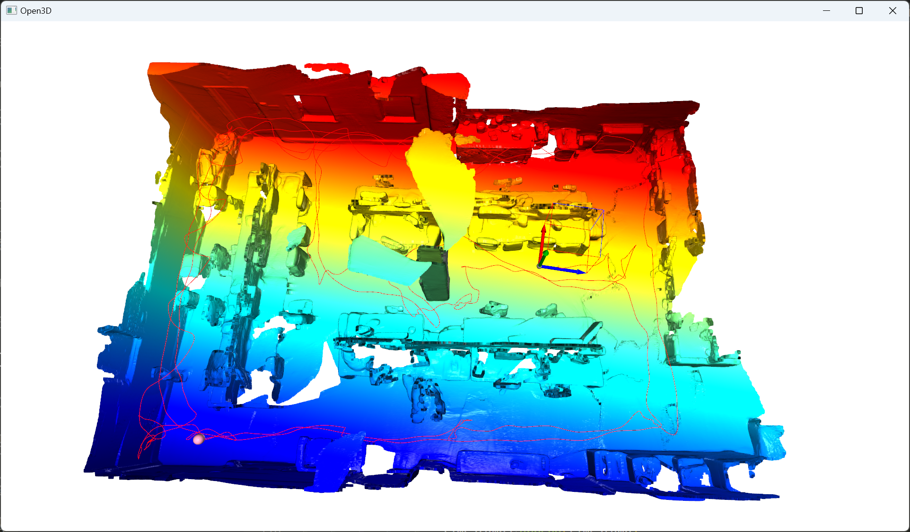
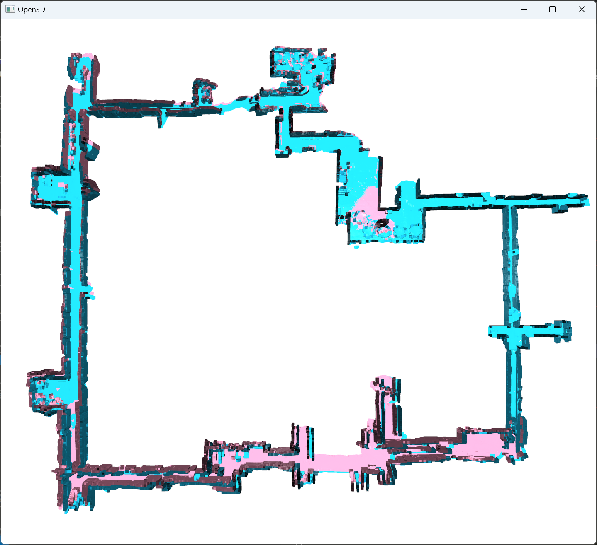
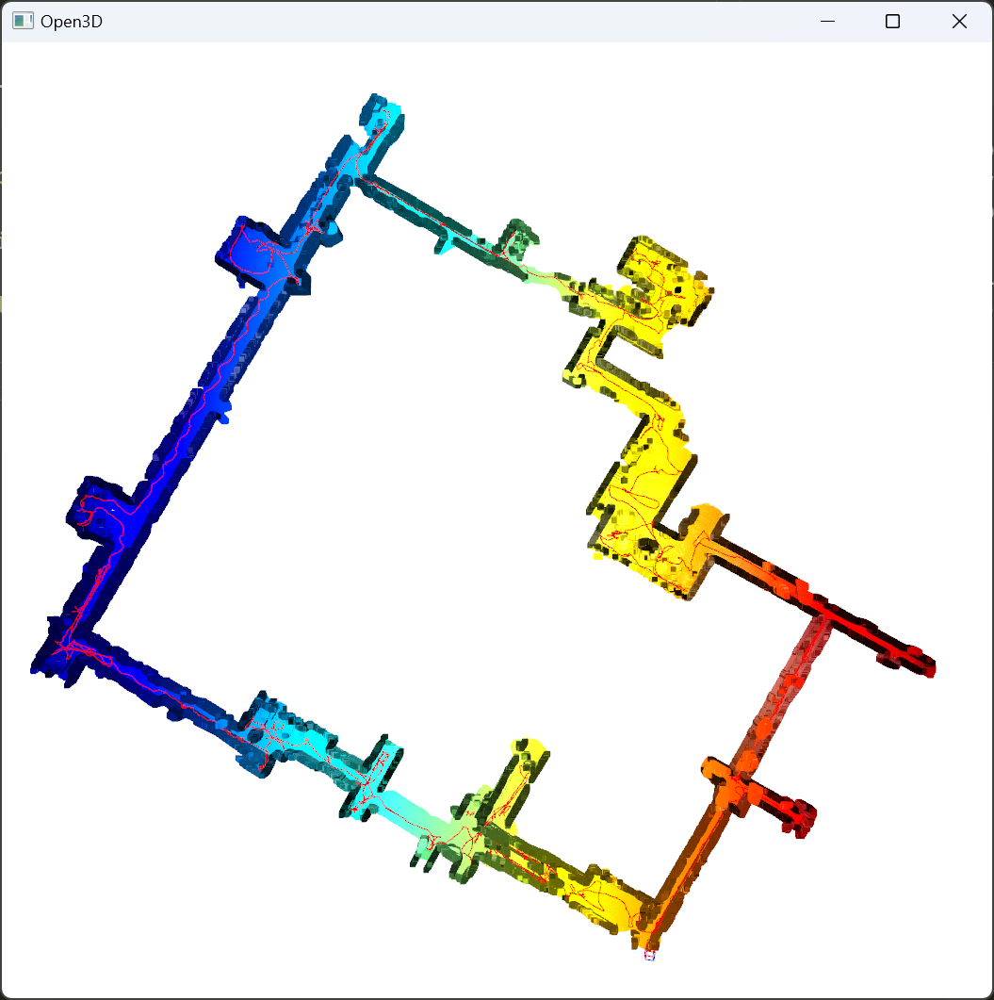
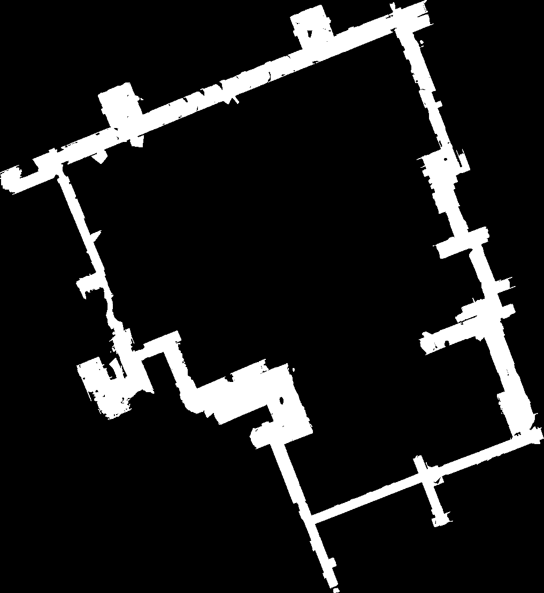

- [Dungeon Assistant](#dungeon-assistant)
  - [Architecture](#architecture)
  - [Clone](#clone)
  - [Scripts](#scripts)
    - [`ply` file and trajectory viewer](#ply-file-and-trajectory-viewer)
    - [Closure Optimization for multiscan's result](#closure-optimization-for-multiscans-result)
    - [Multiple point cloud and trajectory merger](#multiple-point-cloud-and-trajectory-merger)
    - [Registration between two point clouds](#registration-between-two-point-clouds)
    - [Signal strength dataset construction and evaluation](#signal-strength-dataset-construction-and-evaluation)
    - [Floor plan extraction script](#floor-plan-extraction-script)
  - [Example: UPenn Engineering Quad Indoor Localization](#example-upenn-engineering-quad-indoor-localization)
    - [Data](#data)
    - [Reproduce](#reproduce)
    - [More Results](#more-results)
  - [Android Demo App](#android-demo-app)
    - [Usage / Configuration / Build](#usage--configuration--build)
    - [Demo Video](#demo-video)
  - [TODO](#todo)


# Dungeon Assistant

Solution for indoor localization using WiFi signal and LiDAR.

## Architecture

```bash
.
├─android          # Android Demo App
├─capturer         # Android WiFi signal capturer App
├─dataset          # Dataset (huggingface submodule)
├─docs             # README assets
├─multiscan        # multiscan-modified submodule
└─utils            # utils for python scripts
```

Technical report coming soon ...

## Clone

To clone all submodules, use

```bash
git clone --recurse-submodules -j8 git://github.com/JeffersionQin/DungeonAssistant.git
```

Note: the dataset is quite large, you might not want to clone it at first. Check out the usage of `git submodule` for more details.

## Scripts

### `ply` file and trajectory viewer

```bash
$ python ply_viewer.py --help
usage: ply_viewer.py [-h] [--pointcloud POINTCLOUD] [--trajectory TRAJECTORY]

optional arguments:
  -h, --help            show this help message and exit
  --pointcloud POINTCLOUD
                        point cloud file path
  --trajectory TRAJECTORY
                        trajectory file path
```

Example,



### Closure Optimization for multiscan's result

```bash
$ python closure_optimization.py --help                   
usage: closure_optimization.py [-h] [--pointcloud_base POINTCLOUD_BASE] [--pointcloud_prefix POINTCLOUD_PREFIX]
                               [--merge_cnt MERGE_CNT] [--output_dir OUTPUT_DIR]

optional arguments:
  -h, --help            show this help message and exit
  --pointcloud_base POINTCLOUD_BASE
                        base dir of point clouds
  --pointcloud_prefix POINTCLOUD_PREFIX
                        prefix of point cloud file name
  --merge_cnt MERGE_CNT
                        number of continuous (by folder names) point clouds to merge together
  --output_dir OUTPUT_DIR
                        output directory
```

Example,



### Multiple point cloud and trajectory merger

```bash
$ python multi_merger_viewer.py --help
usage: multi_merger_viewer.py [-h] [--pointcloud_base POINTCLOUD_BASE] [--pointcloud_prefix POINTCLOUD_PREFIX]
                              [--merge_cnt MERGE_CNT] [--transformation_dir TRANSFORMATION_DIR]
                              [--overlap_discard_num OVERLAP_DISCARD_NUM] [--pointcloud_out POINTCLOUD_OUT]
                              [--trajectory_out TRAJECTORY_OUT]

optional arguments:
  -h, --help            show this help message and exit
  --pointcloud_base POINTCLOUD_BASE
                        base dir of point clouds
  --pointcloud_prefix POINTCLOUD_PREFIX
                        prefix of point cloud file name
  --merge_cnt MERGE_CNT
                        number of continuous (by folder names) point clouds to merge together
  --transformation_dir TRANSFORMATION_DIR
                        directory storing transformation matrix files, default to be empty
  --overlap_discard_num OVERLAP_DISCARD_NUM
                        number of overlap frames to discard
  --pointcloud_out POINTCLOUD_OUT
                        output point cloud file name
  --trajectory_out TRAJECTORY_OUT
                        output trajectory file name
```

Example,



### Registration between two point clouds

```bash
$ python registration.py --help                           
usage: registration.py [-h] [--pointcloud1 POINTCLOUD1] [--pointcloud2 POINTCLOUD2] [--trajectory1 TRAJECTORY1]
                       [--trajectory2 TRAJECTORY2] [--fast_cache FAST_CACHE] [--icp_cache ICP_CACHE]
                       [--voxel_size_fgr VOXEL_SIZE_FGR] [--voxel_size_icp VOXEL_SIZE_ICP] [--skip_icp]

optional arguments:
  -h, --help            show this help message and exit
  --pointcloud1 POINTCLOUD1
                        first point cloud file path (1 --[transform]-> 2)
  --pointcloud2 POINTCLOUD2
                        second point cloud file path (1 --[transform]-> 2)
  --trajectory1 TRAJECTORY1
                        first trajectory file path
  --trajectory2 TRAJECTORY2
                        second trajectory file path
  --fast_cache FAST_CACHE
                        transformation cache of fast global registration if available. default is none
  --icp_cache ICP_CACHE
                        transformation cache of icp if available. default is none
  --voxel_size_fgr VOXEL_SIZE_FGR
                        voxel size for global fast registration downsampling. default is 0.05
  --voxel_size_icp VOXEL_SIZE_ICP
                        voxel size for icp downsampling. default is 0.05
  --skip_icp            skip icp and only run fgr
  --transformed_trajectory_out TRANSFORMED_TRAJECTORY_OUT
                        output trajectory of the transformed trajectory 1 (to trajectory 2)
```

### Signal strength dataset construction and evaluation

Output file will be in the format of recording time and signal strength of each access point.

```bash
$  python dataset_construction.py --help  
usage: dataset_construction.py [-h] [--trajectory TRAJECTORY] [--wifi WIFI] [--output OUTPUT]

optional arguments:
  -h, --help            show this help message and exit
  --trajectory TRAJECTORY
                        trajectory file path
  --wifi WIFI           wifi file path
  --output OUTPUT       output file path
```

Evaluation script will also output the error statistics.

```bash
$  python evaluation.py --help                                                                                                                                 
usage: evaluation.py [-h] [--trajectory TRAJECTORY] [--wifi WIFI] [--dataset DATASET] [--output OUTPUT]

optional arguments:
  -h, --help            show this help message and exit
  --trajectory TRAJECTORY
                        trajectory file path
  --wifi WIFI           wifi file path
  --dataset DATASET     dataset file path
  --output OUTPUT       output file path
```

Note: on your own usage, please take care of your time zone settings (`US/Eastern`) and might need some modifications to the code. Also, current AP filtering is based on the setting of UPenn Engineering Quad (`SSID == 'AirPennNet'`), you might need to modify the code to fit your own environment.

### Floor plan extraction script

```bash
$ python floorplan_extraction.py --help
usage: floorplan_extraction.py [-h] [--pointcloud POINTCLOUD] [--output OUTPUT] [--scale SCALE]

optional arguments:
  -h, --help            show this help message and exit
  --pointcloud POINTCLOUD
                        first point cloud file path (1 --[transform]-> 2)
  --output OUTPUT       output file path
  --scale SCALE         scale of the floor plan
```

The script will also output the size and scale information of the map generated.

```
minX: -812, minY: -1009
maxX: 294, maxY: 7
scale: 10
floor plan saved to: floorplan.png
```

This will be useful when configurating the Android Demo App.

Example floor plan,



## Example: UPenn Engineering Quad Indoor Localization

The following is an example of using this project to conduct indoor localization in UPenn Engineering Quad.

Penn Engineering: https://www.seas.upenn.edu/

### Data

Check the `dataset` folder, and the repository: https://huggingface.co/datasets/gyrojeff/DungeonAssistant

```
dataset
├─processed                               # processed data
│  ├─Equad-01
│  ├─Equad-02
│  └─Equad-04
└─raw                                     # raw data
    ├─231206 05 - Equad 01 Evening - 1F   # one trial of data collection
    │  └─Segments                         # overlapping sliding window segment
    │      ├─00
    |      ├─...
    │      └─18
    ├─231207 08 - Equad 02 Evening - 1F
    └─231208 10 - Equad 04 Evening - 1F
```

Data are scanned using [MultiScanModified](https://github.com/JeffersonQin/multiscan-modified), cropped using https://github.com/JeffersonQin/multiscan-modified/blob/main/server/crop.py

For the file structure of the processed data, please refer to the command line arguments of the [Reproduce](#reproduce) section. It shows the complete structure of `dataset/processed/Equad-01` as an example.

### Reproduce

Closure optimization for Equad 01 (12/06 Evening [05])

```bash
python closure_optimization.py --pointcloud_base "dataset/raw/231206 05 - Equad 01 Evening - 1F/Segments" --pointcloud_prefix "20231206T222514-0500_2D50E931-A486-4EDE-A859-2982CCB91A95-" --merge_cnt 4 --output_dir dataset/processed/Equad-01/transform
```

Merge and transform for Equad 01 (12/06 Evening [05])

```bash
python multi_merger_viewer.py --pointcloud_base "dataset/raw/231206 05 - Equad 01 Evening - 1F/Segments" --pointcloud_prefix "20231206T222514-0500_2D50E931-A486-4EDE-A859-2982CCB91A95-" --merge_cnt 4 --transformation_dir dataset/processed/Equad-01/transform --overlap_discard_num 6000 --pointcloud_out dataset/processed/Equad-01/pc.ply --trajectory_out dataset/processed/Equad-01/trajectory.jsonl
```

Same for Equad 02 (12/07 Evening [08]), Equad 04 (12/08 Evening [10]).

Registration from 02 -> 01

```bash
python registration.py --pointcloud1 dataset/processed/Equad-02/pc.ply --trajectory1 dataset/processed/Equad-02/trajectory.jsonl --pointcloud2 dataset/processed/Equad-01/pc.ply --trajectory2 dataset/processed/Equad-01/trajectory.jsonl --voxel_size_fgr 0.5 --voxel_size_icp 0.1 --skip_icp --transformed_trajectory_out dataset/processed/Equad-02/trajectory_alignedto_01.jsonl
```

Construct dataset using WiFi signal data from 01.

```bash
python dataset_construction.py --trajectory dataset/processed/Equad-01/trajectory.jsonl --wifi "dataset/raw/231206 05 - Equad 01 Evening - 1F/WiFiCapture_20231206_222454.csv" --output dataset/processed/Equad-01/dataset.csv
```

Evaluation for position prediction from WiFi signal data from 02, using dataset constructed from 01.

```bash
python evaluation.py --trajectory dataset/processed/Equad-02/trajectory_alignedto_01.jsonl --wifi "dataset/raw/231207 08 - Equad 02 Evening - 1F/WiFiCapture_20231207_194322.csv" --dataset dataset/processed/Equad-01/dataset.csv --output dataset/processed/Equad-02/errors_to_01.npy
```

stats | value (m)
:-: | :-:
mean | 4.060915078446458
std | 2.9731415933144287
median | 3.479469846080446
max | 17.191420152840074
min | 0.1086243602998307
25th | 1.762926267979433
75th | 5.421255493003348

Other evaluations are similar.

One more example is between 01 and 05,

```bash
python closure_optimization.py --pointcloud_base "dataset/raw/231216 11 - Equad 05 Afternoon - 1F/Segments" --pointcloud_prefix "20231216T145533-0500_9D8445D3-B4CD-4264-B3C0-76DB1007D351-" --merge_cnt 2 --output_dir dataset/processed/Equad-05/transform

python multi_merger_viewer.py --pointcloud_base "dataset/raw/231216 11 - Equad 05 Afternoon - 1F/Segments" --pointcloud_prefix "20231216T145533-0500_9D8445D3-B4CD-4264-B3C0-76DB1007D351-" --merge_cnt 2 --transformation_dir dataset/processed/Equad-05/transform --overlap_discard_num 6000 --pointcloud_out dataset/processed/Equad-05/pc.ply --trajectory_out dataset/processed/Equad-05/trajectory.jsonl

python registration.py --pointcloud1 dataset/processed/Equad-05/pc.ply --trajectory1 dataset/processed/Equad-05/trajectory.jsonl --pointcloud2 dataset/processed/Equad-01/pc.ply --trajectory2 dataset/processed/Equad-01/trajectory.jsonl --voxel_size_fgr 0.5 --voxel_size_icp 0.1 --skip_icp --transformed_trajectory_out dataset/processed/Equad-05/trajectory_alignedto_01.jsonl

python evaluation.py --trajectory dataset/processed/Equad-05/trajectory_alignedto_01.jsonl --wifi "dataset/raw/231216 11 - Equad 05 Afternoon - 1F/WiFiCapture_20231216_145217.csv" --dataset dataset/processed/Equad-01/dataset.csv --output dataset/processed/Equad-05/errors_to_01.npy
```

### More Results

Evaluation | Mean (m) | Std (m) | Median (m) | Max (m) | Min (m) | 25th | 75th
:-: | :-: | :-: | :-: | :-: | :-: | :-: | :-:
Equad 01 -> 02 (~ 1 Day) | 4.06 | 2.97 | 3.48 | 17.19 | 0.11 | 1.76 | 5.42
Equad 01 -> 04* (~ 2 Days) | 4.28 | 3.45 | 3.24 | 20.85 | 0.05 | 1.69 | 6.33
Equad 01 -> 04 (~ 2 Days) | 4.75 | 7.02 | 3.27 | 83.62 (outlier) | 0.05 | 1.71 | 6.39
Equad 01 -> 05 (~ 10 Days) | 12.05 | 8.07 | 11.02 | 41.23 | 0.15 | 5.65 | 17.37

*: Kick out outlier due to temporary WiFi collection system down.

## Android Demo App

### Usage / Configuration / Build

Notice that currently the Android Demo App is based on the previous example of UPenn Engineering Quad, and the configuration is hard-coded. You might need to modify the code to fit your own environment.

You would need to modify the `minX, maxX, minY, maxY, scale` data in `android/app/src/main/java/moe/gyrojeff/dungeonassistant/MainActivity.java` based on the output of `floorplan_extraction.py`.

Also, you would need to replace the file
- `android/app/src/main/res/mipmap-hdpi/floorplan.png` with your own floor plan
- `android/app/src/main/res/raw/dataset.csv` with your own processed signal dataset

### Demo Video

You can find the demo video here: https://youtu.be/XT8v7n0ZuOk

## TODO

- [ ] Implement Kalman Filter for the Android Demo App
- [ ] Implement the 2D error evaluation script
- [ ] Implement k-NN for k > 1
- [ ] Allow dynamic update of the map and metadata for the Android Demo App
  - [ ] Server based
  - [ ] UI based
- [ ] Permission Request instead of manual grant for the Android Demo App
